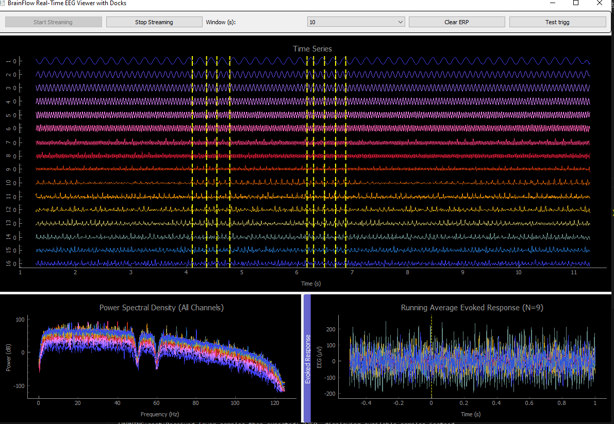

# BrainFlow Real-Time EEG Viewer with ERP and Performance Timing

This project is a real-time EEG visualization and analysis tool built using [BrainFlow](https://brainflow.org/), [PyQtGraph](http://www.pyqtgraph.org/), and [MNE](https://mne.tools/). It supports time-series viewing, power spectral density (PSD) visualization, and running average evoked response potentials (ERPs). Additionally, it records and plots performance metrics for debugging and optimization. This is under development. 

## Features

- **Real-Time EEG Display** with adjustable time window
- **Trigger & Epoching**: Mark events and extract stimulus-locked epochs
- **Power Spectral Density (PSD)**: Frequency-domain view of EEG signals
- **Evoked Response Visualization**: Averaged event-related potentials over time
- **Performance Timing**: Tracks execution time for update loops and epoch extraction
- **BIDS Derivative Export**: Save ERP data in BIDS-compliant format using MNE-BIDS

## Screenshot - EEG Viewer Interface




## Requirements

- Python 3.8+
- [BrainFlow](https://github.com/brainflow-dev/brainflow)
- PyQt5 or PySide2
- PyQtGraph
- NumPy
- SciPy
- Matplotlib
- MNE
- mne-bids

Install dependencies with:

```bash
pip install brainflow pyqtgraph numpy scipy matplotlib mne mne-bids
```

## Usage

Run the script with optional BrainFlow parameters:

```bash
python optimized_viewer_timed.py --board-id 1 --serial-port COM3
```

If you want to simulate data, use the `SYNTHETIC_BOARD` (default):

```bash
python optimized_viewer_timed.py
```

## Interface Overview

- **Start/Stop Streaming**: Begin or end data acquisition
- **Window Dropdown**: Choose time window size for display (in seconds)
- **Clear ERP**: Clear current averaged ERP data
- **Test Trigger**: Injects a trigger and extracts ERP epoch from buffer
- **Docks**:
  - Time Series (multi-channel real-time EEG)
  - PSD (per-channel frequency analysis)
  - ERP (averaged response aligned to triggers)

## Data Export

Evoked responses (ERP) are exported in BIDS-compliant format as MNE `EpochsArray` objects. Files are saved to:

```
./bids_dataset/derivatives/your_pipeline/
```

Make sure this path exists or modify it in the code.

## Performance Profiling

Two plots are saved at the end of a session:

- `update_timings.png`: Timing of real-time update components (data fetching, plotting, etc.)
- `epoch_extraction_timings.png`: Time required to extract and average each ERP epoch

These help diagnose performance bottlenecks.

## License

This project is released under the MIT License.

## Acknowledgements

- [BrainFlow](https://brainflow.org/)
- [PyQtGraph](http://www.pyqtgraph.org/)
- [MNE-Python](https://mne.tools/stable/index.html)
